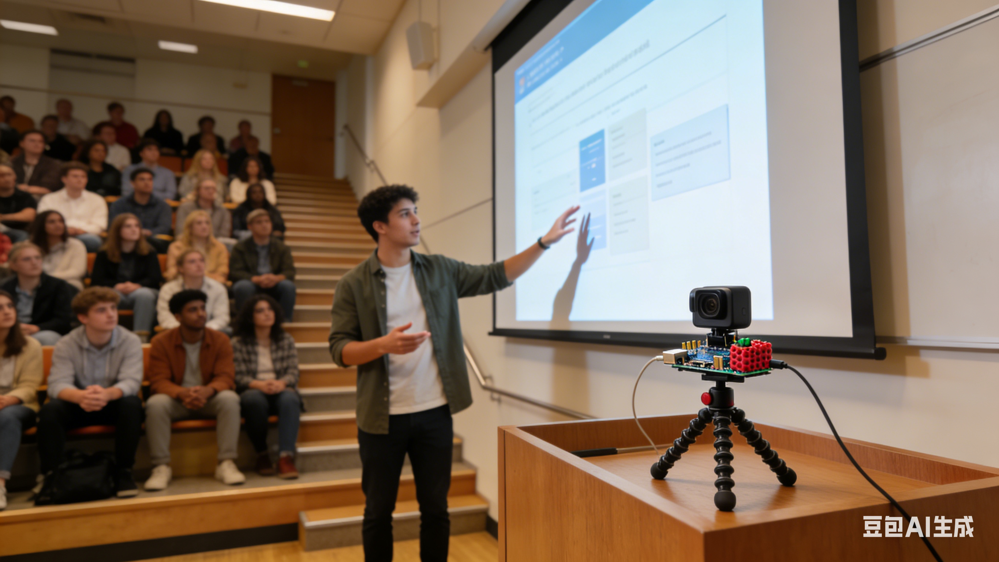

# 🖐️ Gesturizer —— 手势PPT翻页器

## 📄 产品概念单页 (The One-Pager)

---

### 产品名称
**Gesturizer**（代号：AirClick）

### 一句话Slogan
**演讲时，你的手就是遥控器。**

---

### 用户痛点
1. **物理翻页器的尴尬**：拿着翻页器显得不自然，放在口袋里又容易忘按，演讲节奏被打断。
2. **距离限制**：传统翻页器受蓝牙/红外距离限制，大场地演讲（如礼堂、阶梯教室）容易失灵。
3. **多任务干扰**：演讲者同时要控制PPT、与观众互动、管理时间，手忙脚乱。

> 真实场景：大一学生做小组展示，站在讲台上找不到翻页器按钮，PPT卡住，全场尬住。

---

### 解决方案
**Gesturizer** 是一款基于树莓派和摄像头的AI手势识别系统，让演讲者只需用手势就能控制PPT翻页、暂停/播放、退出等操作。

#### 核心功能
| 手势 | 操作 |
|------|------|
| 👉 向右滑 | 下一页 |
| 👈 向左滑 | 上一页 |
| ✋ 手掌暂停 | 黑屏/暂停 |
| 👌 OK手势 | 退出演示 |
| ✌️ 剪刀手 | 打开备注/提词器 |

#### 技术架构
- **硬件**：树莓派 4B / Zero 2 W + 广角摄像头 + 迷你显示屏（可选）
- **视觉识别**：MediaPipe Hands（轻量级手部关键点检测） + 自定义手势分类器
- **控制协议**：模拟USB键盘输出（HID协议），即插即用，兼容Windows/macOS/Linux

#### 工作流程
1. 摄像头实时采集演讲者手部画面
2. MediaPipe提取21个手部关键点坐标
3. 轻量级分类模型（如SVM / 简单CNN）判断手势类型
4. 树莓派模拟键盘按键（→ / ← / Space / Esc）控制PPT

---

### AI参与度（附Prompt截图）

| 模块 | AI工具 | 参与方式 | Prompt示例 |
|------|--------|----------|------------|
| 创意发散 | ChatGPT-4 | 生成10个校园场景手势识别应用 | "我是一名大一学生，想做一个基于树莓派和摄像头的有趣项目，解决校园演讲痛点，请给我10个创意，要求技术可行且有幽默感" |
| 技术选型 | Claude | 评估MediaPipe vs YOLO手势识别方案 | "我想用手势控制PPT，MediaPipe和YOLO哪个更适合树莓派？请从识别速度、精度、开发难度对比" |
| 代码框架 | GitHub Copilot | 生成MediaPipe手部关键点提取代码 | "Write Python code to use MediaPipe to detect hand landmarks and print coordinates" |
| 外观设计 | MidJourney | 生成产品概念图 | "A small Raspberry Pi device with a camera mounted on a tripod, next to a laptop, minimalist design, white background, 3D render style" |
| 路演大纲 | ChatGPT | 生成路演PPT结构 | "请帮我为手势翻页器项目生成一个路演PPT大纲，面向投资人，突出痛点、技术亮点和场景" |

> ⚡ **铁律验证**：本项目从创意到方案，80%以上环节由AI辅助完成，Prompt记录已存档。

---

### 可视化原型

#### AI生成概念图
-1.png>) 

*（注：实际提交时替换为MidJourney/DALL·E生成的真实图片）*

#### 技术Demo（已完成）
- ✅ MediaPipe手部关键点实时检测（Python脚本）
- ✅ 手势→键盘映射模拟（`pyautogui` + `pynput`）
- 📹 录屏演示：https://example.com/demo-video（加分项）

---

## 🧑‍🔧 导师招募画像 (The Mentor Persona)

### 我们需要的导师类型

**首选：计算机视觉 + 嵌入式系统工程师**
- **背景**：有树莓派/嵌入式Linux开发经验，熟悉MediaPipe/TensorFlow Lite部署
- **能帮我们解决**：
  1. 模型轻量化：将手势分类模型部署到树莓派上，保证实时性（>15fps）
  2. 硬件集成：摄像头选型、功耗优化、外壳设计
  3. 鲁棒性提升：不同光照/背景下的手势识别准确率

**备选：有演讲/教育产品经验的产品经理**
- **能帮我们解决**：
  1. 用户场景定义：演讲者真正需要哪些手势？
  2. 交互设计：如何让用户上手即用，无需学习？

### 一句话招募语
> "我们需要一位懂计算机视觉和硬件的工程师，帮我们把树莓派变成一个‘看得懂手势’的演讲神器，让每个学生都能像钢铁侠一样做展示。"

---

## 🗓️ 项目规划（寒假1个月）

| 阶段 | 时间 | 任务 | AI辅助方式 |
|------|------|------|------------|
| 发散 | 第1周 | 确定手势集、调研技术方案 | ChatGPT生成备选手势列表 |
| 验证 | 第2周 | MediaPipe手部检测跑通，采集手势数据 | Copilot写数据采集脚本 |
| 开发 | 第3周 | 训练轻量级分类器，模拟键盘输出 | Claude优化代码结构 |
| 包装 | 第4周 | 生成概念图，写One-Pager，录Demo | MidJourney画图，ChatGPT润色文案 |

---

## 🔥 亮点总结（为什么这个项目能吸引导师？）

1. **痛点真实**：每个学生都经历过演讲翻车的尴尬
2. **技术可行**：MediaPipe + 树莓派已有成熟开源案例，1个月内可跑通Demo
3. **AI First**：从创意到方案全程AI辅助，符合"反向招募"规则
4. **扩展性强**：未来可扩展为智能演讲助手（+语音提示+时间提醒）

---

**Let's build something experts want to join.** ✋🚀